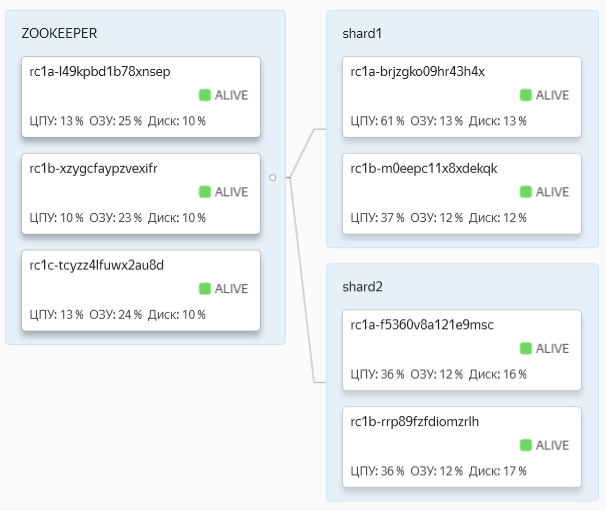
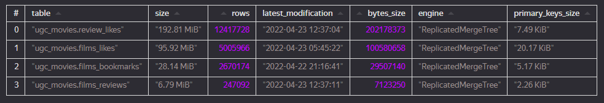
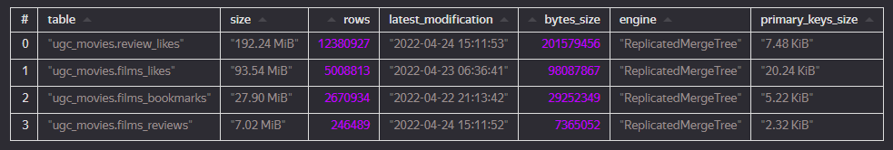

## Результаты исследования по измерению скорости чтения и агрегации данных из базы данных Clickhouse

### Структура кластера БД
База данных запущена на облачной платформе Yandex.Cloud. Кластер содержит два шарда по две реплики.

Топология кластера базы данных:

Место, занимаемое таблицами базы данных на диске:

Чтение из всех таблиц базы данных происходит одновременно и асинхронно, имитируя режим чтения из базы данных в
режиме реального времени. Чтение осуществляется отдельными клиентами, подключающимися к разным хостам кластера.

### Результаты замеров времени выполнения запросов

1. Получение списка понравившихся пользователю фильмов:

  - среднее время выполнения запроса: **43.632** мс;

  - количество записей в таблице `films_bookmarks`: **5,341,108**;

2. Получение информации о рецензии к фильму, включая получения списка лайков и дизлайков рецензии:

  - среднее время выполнения запроса: **132.581 мс**;

  - количество записей в таблице `films_reviews`: **493,581**;

  - количество записей в таблице `review_likes`: **24,798,655**;

3. Получение списка понравившихся пользователю фильмов:

  - среднее время выполнения запроса: **152.758 мс**;

  - количество записей в таблице `films_likes`: **10,014,779**;

4. Получение средней пользовательской оценки и количества лайков и дизлайков у фильма:

  - среднее время выполнения запроса: **171.688 мс**;

  - количество записей в таблице `films_likes`: **10,014,779**;

Результаты замеров времени выполнения запросов к Clickhouse учитывают задержки в сетевом соединении с БД.

Оценка величины сетевых задержек:

  - сервер Clickhouse_shard1_replica1: `{'host': 'rc1a-brjzgko09hr43h4x.mdb.yandexcloud.net', 'avg_latency': 7.87, 'min_latency': 6.48, 'max_latency': 29.55, 'packet_loss': 0.0}`

  - сервер Clickhouse_shard1_replica2: `{'host': 'rc1b-m0eepc11x8xdekqk.mdb.yandexcloud.net', 'avg_latency': 11.1, 'min_latency': 9.86, 'max_latency': 11.69, 'packet_loss': 0.0}`

  - сервер Clickhouse_shard2_replica1: `{'host': 'rc1a-f5360v8a121e9msc.mdb.yandexcloud.net', 'avg_latency': 7.66, 'min_latency': 5.56, 'max_latency': 11.93, 'packet_loss': 0.0}`

  - сервер Clickhouse_shard2_replica2: `{'host': 'rc1b-rrp89fzfdiomzrlh.mdb.yandexcloud.net', 'avg_latency': 11.29, 'min_latency': 9.38, 'max_latency': 25.05, 'packet_loss': 0.0}`

