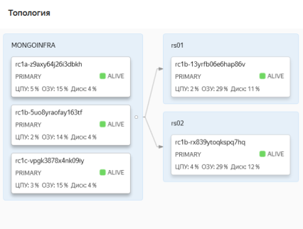
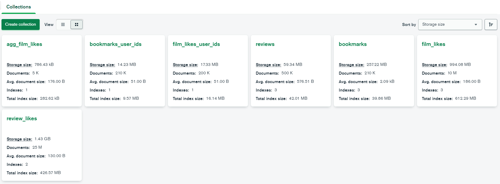
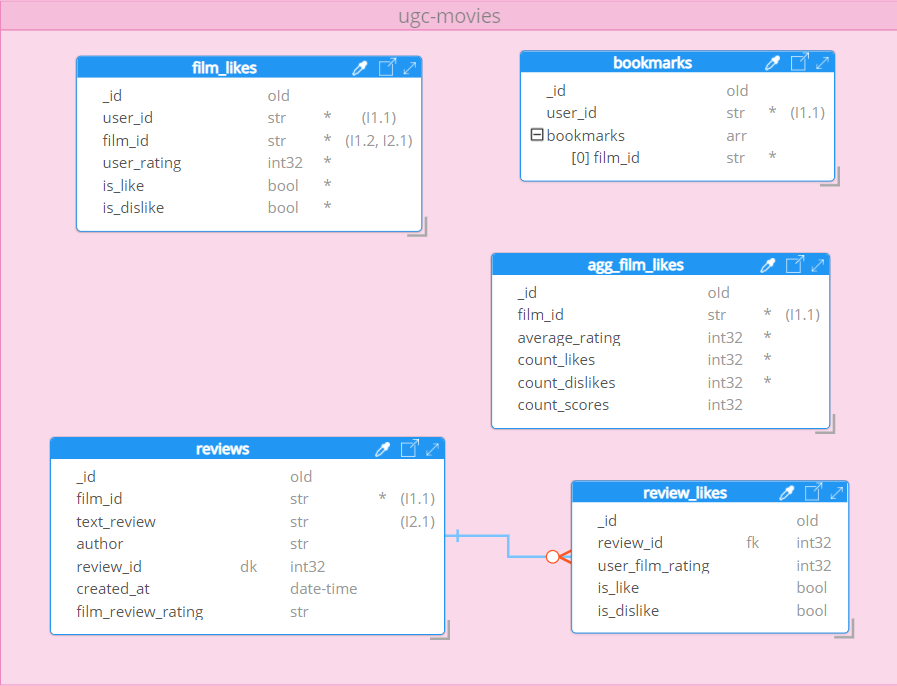

## Результаты исследования по измерению скорости чтения и агрегации данных из базы данных MongoDB

### Структура кластера БД
База данных запущена на облачной платформе Yandex.Cloud. Кластер содержит два шарда PRIMARY, без реплицирования.

Топология базы данных:

Перечень и сводная информация по коллекциям базы данных ugc-movies:

ER-диаграмма модели коллекций базы данных:

В коллекциях настроено шардирование.

Чтение из всех коллекций базы данных происходит одновременно и асинхронно, имитируя режим чтения из базы данных в 
режиме реального времени.
 
### Результаты замеров времени выполнения запросов

1. Получение списка понравившихся пользователю фильмов:

  - среднее время выполнения запроса: **22.531** мс;

  - количество документов в коллекции `ugc-movies.bookmarks`: **210,496**;

2. Получение информации о рецензии к фильму, включая получения списка лайков и дизлайков рецензии:

  - среднее время выполнения запроса: **42.031 мс**;

  - количество документов в коллекции `ugc-movies.reviews`: **500,429**;

  - количество документов в коллекции `ugc-movies.review_likes`: **24,964,205**;

3. Получение списка понравившихся пользователю фильмов:

  - среднее время выполнения запроса: **25.316 мс**;

  - количество документов в коллекции `ugc-movies.film_likes`: **10,001,423**;

4. Получение средней пользовательской оценки и количества лайков и дизлайков у фильма:

  - среднее время выполнения запроса: **29.937 мс**;

  - количество документов в коллекции `ugc-movies.film_likes`: **10,001,423**;

Результаты замеров времени выполнения запросов к MongoDB учитывают задержки в сетевом соединении с БД.

Оценка величины сетевых задержек:

  - сервер MONGOINFRA#1: `{'host': 'rc1a-z9axy64j26i3dbkh.mdb.yandexcloud.net', 'avg_latency': 7.5, 'min_latency': 5.6, 'max_latency': 19.92, 'packet_loss': 0.0}`

  - сервер MONGOINFRA#2: `{'host': 'rc1b-5uo8yraofay163tf.mdb.yandexcloud.net', 'avg_latency': 10.89, 'min_latency': 10.04, 'max_latency': 11.99, 'packet_loss': 0.0}`

  - сервер MONGOINFRA#3: `{'host': 'rc1c-vpgk3878x4nk09iy.mdb.yandexcloud.net', 'avg_latency': 4.99, 'min_latency': 4.48, 'max_latency': 10.77, 'packet_loss': 0.0}`

