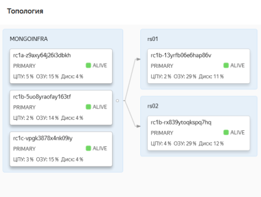
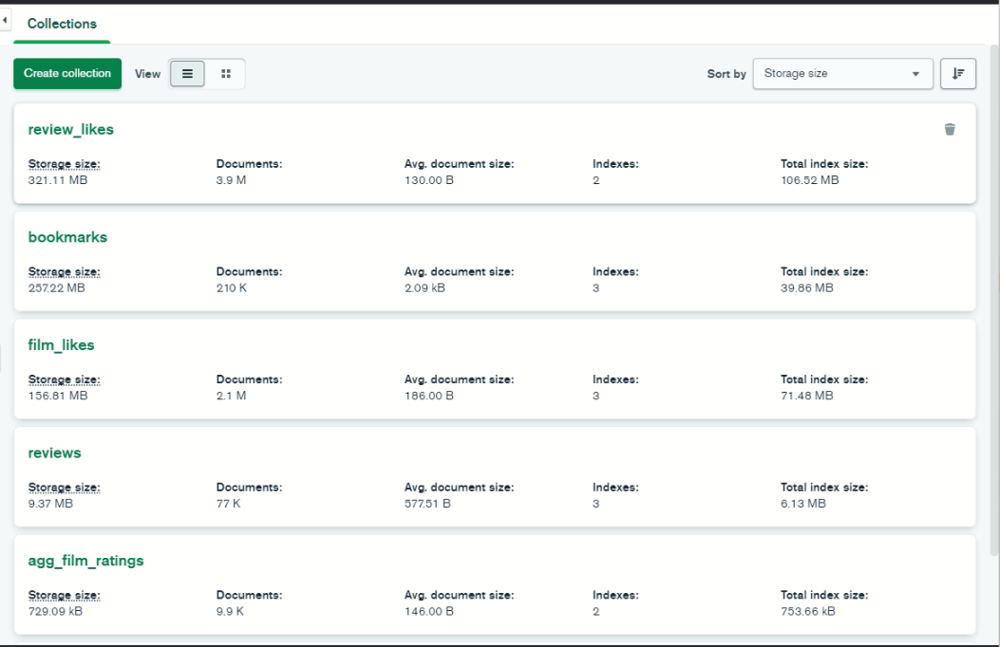

## Результаты исследования по измерению скорости чтения и агрегации данных из базы данных MongoDB

### Структура кластера БД
База данных запущена на облачной платформе Yandex.Cloud.
Кластер содержит два шарда PRIMARY, без реплицирования.

Топология базы данных:

Перечень и сводная информация по коллекциям базы данных ugc-movies:

В коллекциях настроено шардирование.

### Результаты замеров времени выполнения запросов

1. Получение списка понравившихся пользователю фильмов:

  - среднее время выполнения запроса: **18.165** мс;

  - количество документов в коллекции `ugc-movies.bookmarks`: **210,001**;

2. Получение информации о рецензии к фильму, включая получения списка лайков и дизлайков рецензии:

  - среднее время выполнения запроса: **32.356 мс**;

  - количество документов в коллекции `ugc-movies.reviews`: **77,495**;

  - количество документов в коллекции `ugc-movies.review_likes`: **3,898,275**;

3. Получение списка понравившихся пользователю фильмов:

  - среднее время выполнения запроса: **15.565 мс**;

  - количество документов в коллекции `ugc-movies.film_likes`: **2,063,187**;

4. Получение средней пользовательской оценки и количества лайков и дизлайков у фильма:

  - среднее время выполнения запроса: **16.915 мс**;

  - количество документов в коллекции `ugc-movies.film_likes`: **2,063,187**;

Результаты замеров времени выполнения запросов к MongoDB учитывают задержки в сетевом соединении с БД.

Оценка величины сетевых задержек:

  - сервер MONGOINFRA#1: `{'host': 'rc1a-z9axy64j26i3dbkh.mdb.yandexcloud.net', 'avg_latency': 7.64, 'min_latency': 6.83, 'max_latency': 27.17, 'packet_loss': 0.0}`

  - сервер MONGOINFRA#2: `{'host': 'rc1b-5uo8yraofay163tf.mdb.yandexcloud.net', 'avg_latency': 10.81, 'min_latency': 9.73, 'max_latency': 17.54, 'packet_loss': 0.0}`

  - сервер MONGOINFRA#3: `{'host': 'rc1c-vpgk3878x4nk09iy.mdb.yandexcloud.net', 'avg_latency': 5.27, 'min_latency': 4.64, 'max_latency': 5.93, 'packet_loss': 0.0}`
